# 👨🏻‍💻 Student Management System 🚀

This is a web-based Student Management System built using Django. It provides a centralized platform to manage student data including academic records, attendance, profiles, and performance metrics efficiently.

## 🧠 Problem Statement
Educational institutions often face challenges in efficiently managing:
- Student registration and profile data
- Attendance records
- Academic performance analytics & Visualization
- Communication among students, teachers, and administrators

This process is time-consuming, inconvenient, and overwhelming, especially when we have to manage large students data.
Manual or scattered systems lead to data inconsistency and inefficiencies.

---

## 💡 Proposed Solution
This system offers:
- Role-based access (Students, Teachers, Officials)
- Centralized student database
- Analytics Dashboard
- OTP-based verification
- Easy of Data Sharing 
- Visual insights for data-driven decisions
- Auto-marking of register/login and data modifications
- Multi-Language feature 

---

    
## 🛠️ Tech Stack
Frontend ⇄ Django Views ⇄ Models ⇄ Database
| Component           |              Technology             |
|---------------------|-------------------------------------|
| Backend             | Python Django                       |
| Frontend            | HTML, CSS, JavaScript, Bootstrap    |
| Data Analysis       | Pandas, Matplotlib                  |
| Email & OTP         | SMTP, Django Email Backend          |
| Database            | MySQL                               |

## 🔁 Core Modules & Workflow

1. **User Registration** (Students & Teachers)
2. **Role-based Login** (Admin, Teachers, Students, Officials)
3. **OTP Verification** on Signup
4. **Student Data Management** (CRUD operations)
5. **Attendance Management**
6. **Performance Dashboard with Charts**
7. **Search & Filter Student Records**
8. **Contact Us & Admin Interaction Panel**

--- 

## 👥 User Roles

- **Admin/Officials** – Full control over student/teacher data
- **Teacher** – Manage attendance, student performance
- **Student** – View their data and request edits

---

## 🖼️ Project Interface

### 🔹 Home Page  
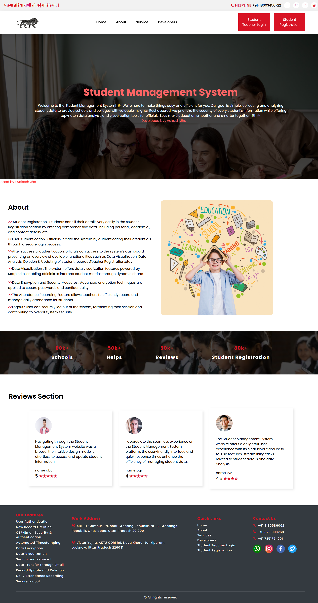

### 🔹 Contact Us (Developer)  
.png)

### 🔹 Officials Login  
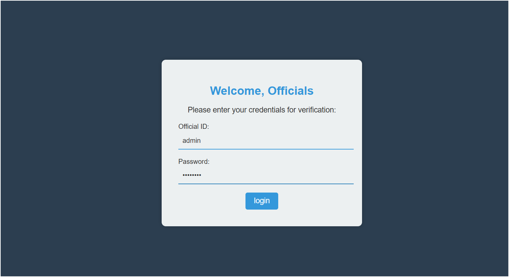

### 🔹 Services Page  
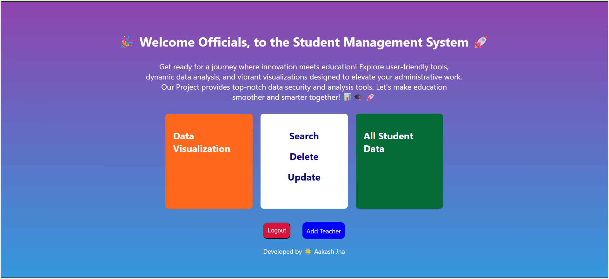

### 🔹 Data Visualization Page  
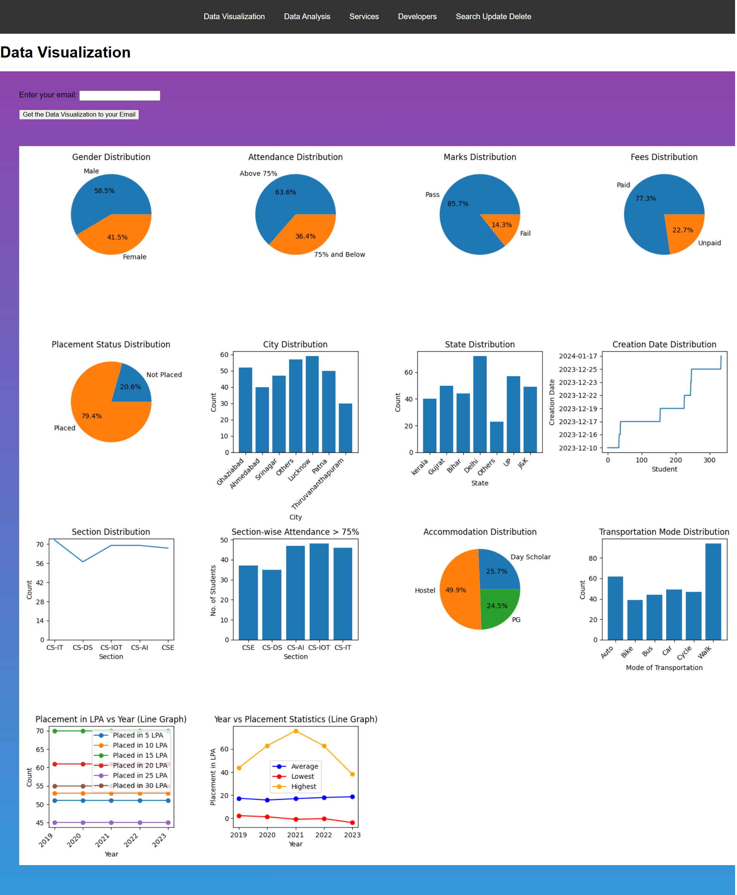

### 🔹 Search Page  
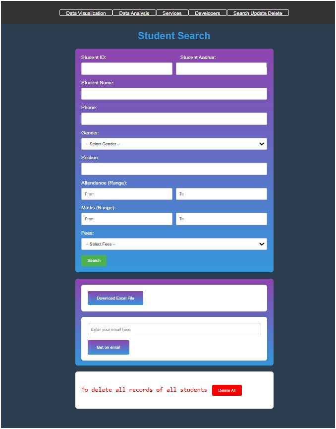

### 🔹 All Student Data  
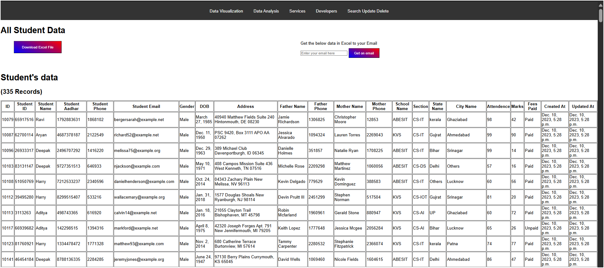

### 🔹 Teacher Registration  
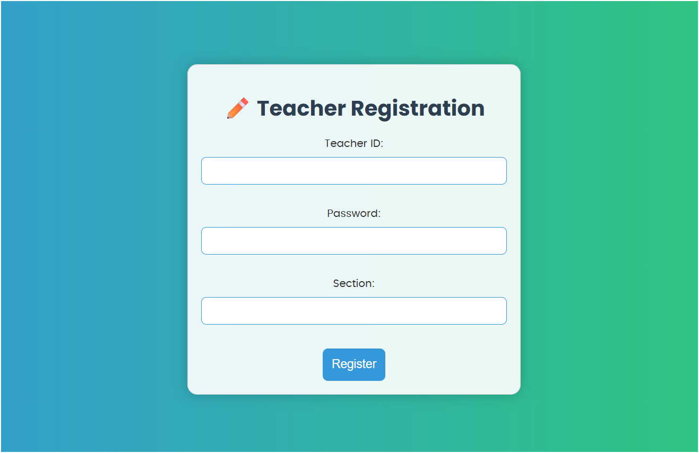

### 🔹 Student Registration  
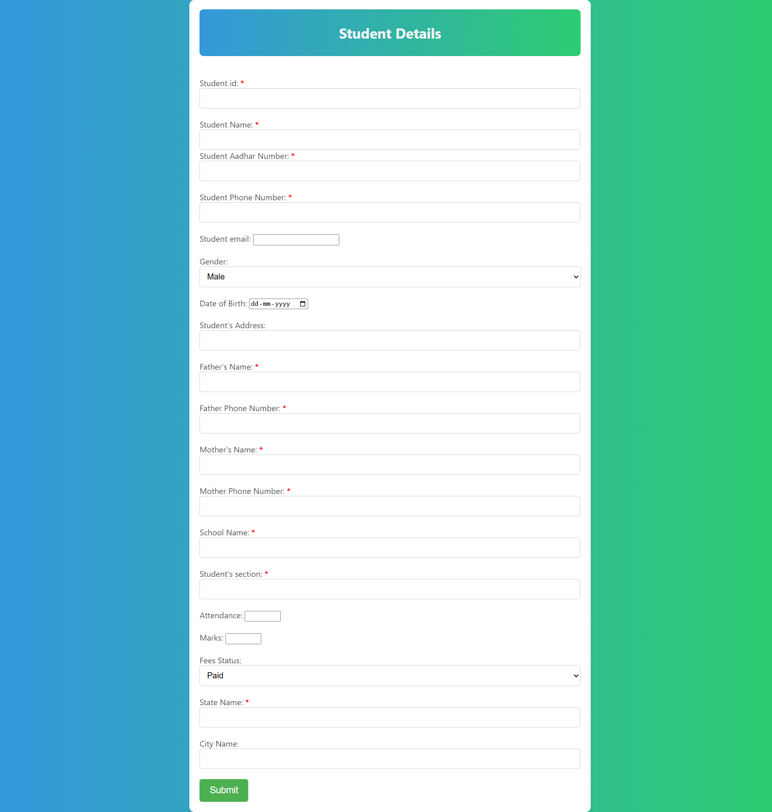

### 🔹 OTP Verification  
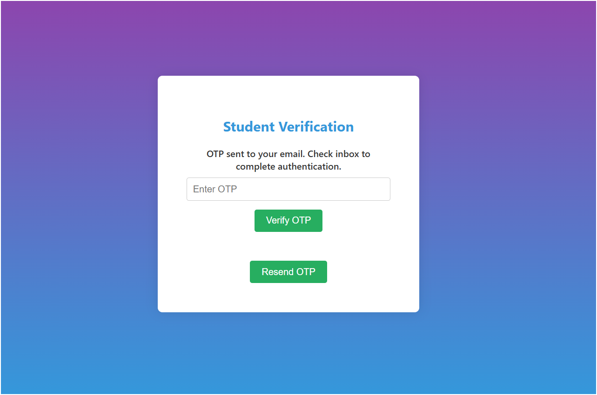

### 🔹 Success Page  
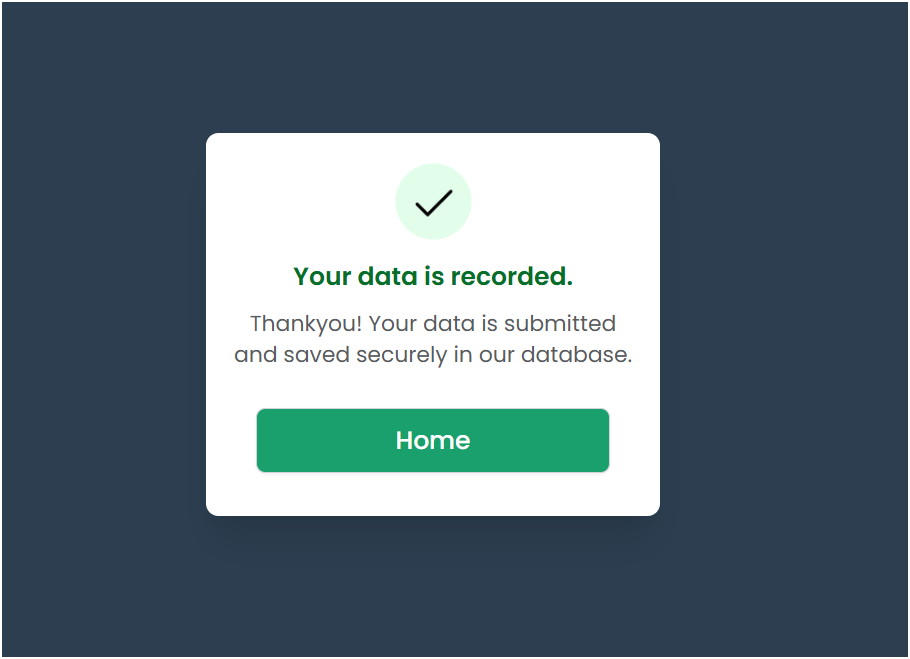

### 🔹 Student & Teacher Login  
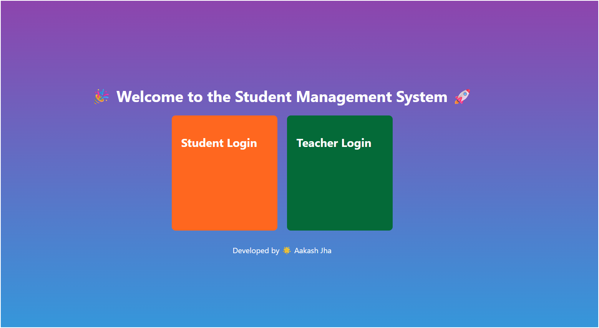

### 🔹 Student Login  
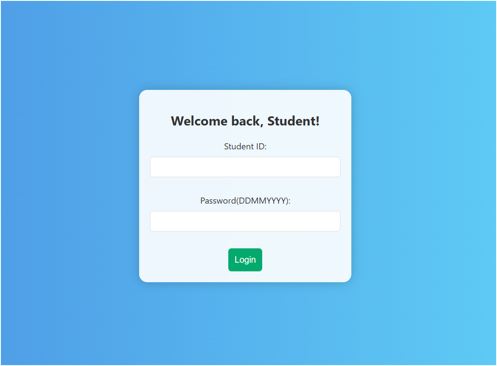

### 🔹 Teacher Login  
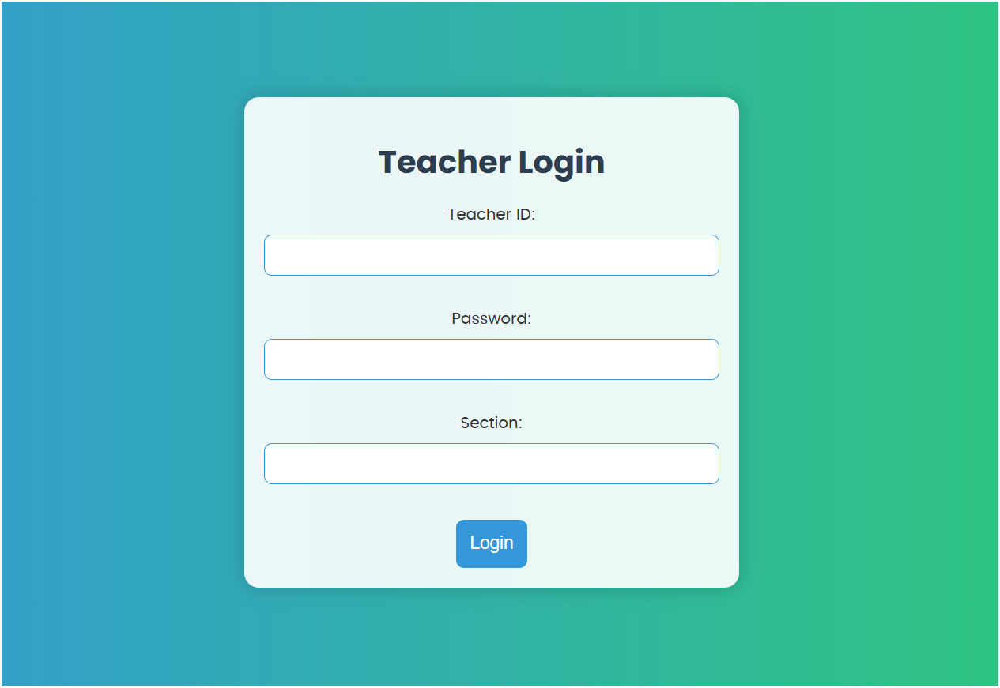

### 🔹 Teacher Attendance (CSE)  
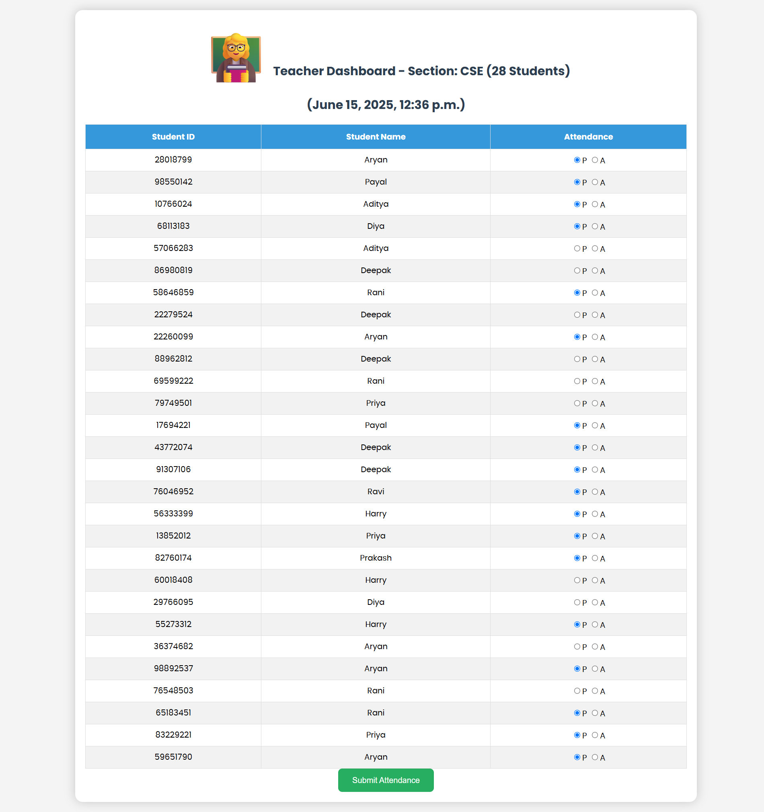

--- 

## 💰 Revenue Model
- 🏫 **Institutional Licensing** for schools, colleges, and universities  
- 👨‍🎓 **Premium Access** (e.g., analytics, reports, progress tracking)  
- 📊 **Advanced Reporting Module** as a paid add-on for institutions  
- 🧑‍🏫 **Faculty Tools** and dashboards available via subscription  
- 📢 **Ad placements** for educational tools and resources  

## 🔮 Future Updates
- 📲 **Mobile App Version** (Android/iOS) 
- 🌐 **Integration with Government Education Portals**  
- 🧮 **AI-based Student Performance Prediction**  
- 📑 **Automated Report Card Generation**  
- 🛡️ **Biometric/QR-based Attendance System**  

